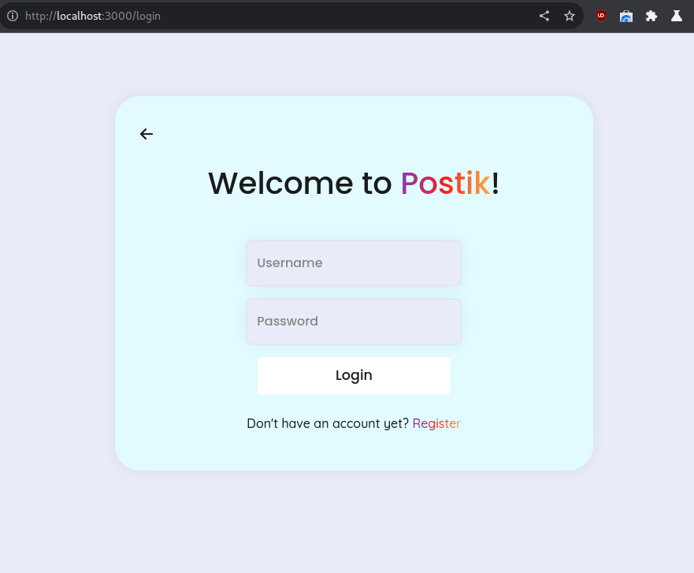

<h1 align="center" style="font-size: 7rem;">Postik Front-End</h1>

# What is postik?:

_This project was initially conceived as a challenge proposed by [Alura Latam](https://www.aluracursos.com) on behalf of the [Oracle Next Generation](https://www.oracle.com/mx/education/oracle-next-education/) program in which I participate. However, the focus shifted to have a broader scope; in this case, it evolved into a **full-stack project** (using Spring + React), with this repository serving as the backend part of the API._

_Postik is a simulation of a Twitter-like web startup, where users can register, log in, and post their thoughts, as well as view posts from other users. Users have the ability to create, edit, and delete their posts. The main focus is to create a complete **CRUD system** and **security** rather than building a website with all the typical functionalities of any social network._

## ScreenShots

|  |  |
| ----------- | ----------- |
|  |  |
|  |  |
|  |  |

## Getting started

### TL;DR

To get started developing right away:

* start the development server with `npm start`

### Pre-requisites

```
- React 18 or higher.
- Nodejs 14 or higher.
- My Backend API or anyother compatible. 
```

## Features

_Some of the features incluides:_

```
- Ability to register and log in.
- CRUD for user posts.
- All responses are pageable.
- JWT token management.
- Connection to the React web application.
- Better implementation of JWT tokens (updated for new jsonwebtoken versions).
- Exception handled.
```


## Backend

Here is the repository to my backend in Spring Boot [Postik API](https://github.com/classTemporal/postik-api)

## Environment

You need to setup the following environment:

* REACT_APP_BACK_END_IP (in the .env file you can modify it)

## Contributing

This repository is intended to be a part of my portfolio, but it's ok if you want to send me a pull request to improve my code.

For details, check out [CONTRIBUTING.md](CONTRIBUTING.md).

## Credits

* **Angel Pacheco** - *Developer of the project* - [LinkedIn](https://www.linkedin.com/in/angel-temporal-pacheco/https://github.com/villanuevan) [GitHub](https://github.com/classTemporal)
* **Oracle** - *The financiers to support learning about Java and Spring.* - [Oracle](https://www.oracle.com)
* **Alura Latam** - *Where I learn the basics about Java and Spring thanks to the ONE program* - [Alura Latam](https://www.aluracursos.com)
* **ChatGPT** - *For helping me to understand better about React* - [ChatGPT](https://chat.openai.com/)

## License

This project is licensed under the [GNU General Public License v3.0](LICENSE.md). You can use, modify, and distribute this software according to the terms of that license.
